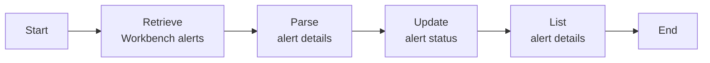

# Modify alert status after checking alert details
This task retrieves data about incident-related Workbench alerts and then modifies the status of these alerts after investigation is completed.

## Related APIs
- [Get alerts list](https://automation.trendmicro.com/xdr/api-v3#tag/Workbench/paths/~1v3.0~1workbench~1alerts/get)
- [Modify alert status](https://automation.trendmicro.com/xdr/api-v3#tag/Workbench/paths/~1v3.0~1workbench~1alerts~1{id}/patch)

## Required products
- At least one Trend Micro product that connects to Trend Vision One

## Sample code
- [Python](python/)
