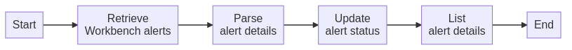

# Modify alert status after checking alert details
This task retrieves data about incident-related Workbench alerts and then modifies the status of these alerts after investigation is completed.
  

## Related APIs
- [Get alert history with details](https://automation.trendmicro.com/xdr/api-v2#tag/Alerts/paths/~1v2.0~1xdr~1workbench~1workbenchHistories/get)
- [Edit alert status](https://automation.trendmicro.com/xdr/api-v2#tag/Alerts/paths/~1v2.0~1xdr~1workbench~1workbenches~1{workbenchId}/put)

## Required products
- At least one Trend Micro product that connects to Trend Micro Vision One

## Sample code
- [Python](python/)
