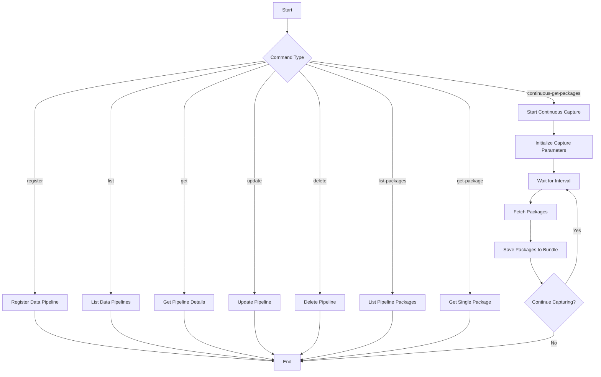

# Datalake Pipeline API Cookbook
This sample demonstrates how to use the Trend Vision One API to manage data pipelines, retrieve data packages, and continuously capture data events.

## Related APIs
- [Data Pipeline Management API](https://portal.xdr.trendmicro.com/index.html#/admin/automation_center?goto=api&from=v3.0&tag=tag%2FDatalake-Pipeline)

## Required products
- At least one product connected to Trend Vision One

## Sample code
- [Python](python/)
