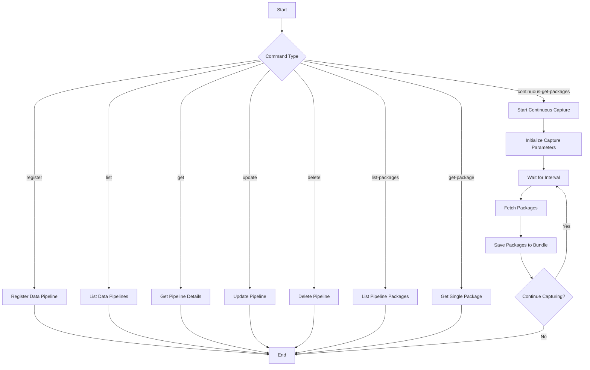

# Datalake Pipeline API cookbook

## Related API
- [Data Pipeline Management API](https://automation.trendmicro.com/xdr/api-v3/#tag/Datalake-Pipeline)

## Required Products
- At least one Trend Micro product that connects to Trend Vision One

## Sample code
- [Python](python/)