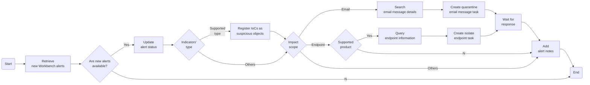

# Take a response action on the highlighted object in a Workbench alert
This task identifies the highlighted object in a Workbench alert and then takes a response action on that object.

## Related APIs
- [Get alerts list](https://portal.xdr.trendmicro.com/index.html#/admin/automation_center?goto=api&from=v3.0&tag=tag%2FWorkbench%2Fpaths%2F~1v3.0~1workbench~1alerts%2Fget)
- [Modify alert status](https://portal.xdr.trendmicro.com/index.html#/admin/automation_center?goto=api&from=v3.0&tag=tag%2FWorkbench%2Fpaths%2F~1v3.0~1workbench~1alerts~1%7Bid%7D%2Fpatch)
- [Get endpoint data](https://portal.xdr.trendmicro.com/index.html#/admin/automation_center?goto=api&from=v3.0&tag=tag%2FSearch%2Fpaths%2F~1v3.0~1eiqs~1endpoints%2Fget)
- [Isolate endpoints](https://portal.xdr.trendmicro.com/index.html#/admin/automation_center?goto=api&from=v3.0&tag=tag%2FEndpoint%2Fpaths%2F~1v3.0~1response~1endpoints~1isolate%2Fpost)
- [Get email activity data](https://portal.xdr.trendmicro.com/index.html#/admin/automation_center?goto=api&from=v3.0&tag=tag%2FSearch%2Fpaths%2F~1v3.0~1search~1emailActivities%2Fget)
- [Quarantine email message](https://portal.xdr.trendmicro.com/index.html#/admin/automation_center?goto=api&from=v3.0&tag=tag%2FEmail%2Fpaths%2F~1v3.0~1response~1emails~1quarantine%2Fpost)

## Required products
- At least one of the following: Deep Security, Trend Cloud One - Workload Security, Trend Micro Apex One, Trend Micro Apex One (Mac), XDR Endpoint Sensor
- Cloud App Security

## Sample code
- [Python](python/)
