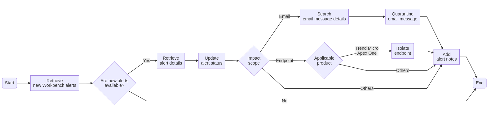

# Take a response action on the highlighted object in a Workbench alert
This task identifies the highlighted object in a Workbench alert and then takes a response action on that object.
  

## Related APIs
- [Get alerts list](https://automation.trendmicro.com/xdr/api-v3#tag/Workbench/paths/~1v3.0~1workbench~1alerts/get)
- [Modify alert status](https://automation.trendmicro.com/xdr/api-v3#tag/Workbench/paths/~1v3.0~1workbench~1alerts~1{id}/patch)
- [Get endpoint data](https://automation.trendmicro.com/xdr/api-v3#tag/Search/paths/~1v3.0~1eiqs~1endpoints/get)
- [Isolate endpoints](https://automation.trendmicro.com/xdr/api-v3#tag/Endpoint/paths/~1v3.0~1response~1endpoints~1isolate/post)
- [Get email activity data](https://automation.trendmicro.com/xdr/api-v3#tag/Search/paths/~1v3.0~1search~1emailActivities/get)
- [Quarantine email message](https://automation.trendmicro.com/xdr/api-v3#tag/Email/paths/~1v3.0~1response~1emails~1quarantine/post)

## Required products
- At least one of the following: Deep Security, Trend Micro Cloud One - Workload Security, Trend Micro Apex One, Trend Micro Apex One (Mac), XDR Endpoint Sensor
- Cloud App Security

## Sample code
- [Python](python/)
