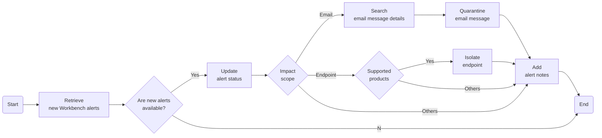

# Take a response action on the highlighted object in a Workbench alert
This task identifies the highlighted object in a Workbench alert and then takes a response action on that object.

## Related APIs
- [Get alert history with details](https://automation.trendmicro.com/xdr/api-v2#tag/Alerts/paths/~1v2.0~1xdr~1workbench~1workbenchHistories/get)
- [Edit alert status](https://automation.trendmicro.com/xdr/api-v2#tag/Alerts/paths/~1v2.0~1xdr~1workbench~1workbenches~1{workbenchId}/put)
- [Query information for multiple endpoints](https://automation.trendmicro.com/xdr/api-v2#tag/Search/paths/~1v2.0~1xdr~1eiqs~1query~1batch~1endpointInfo/post)
- [Isolate endpoint](https://automation.trendmicro.com/xdr/api-v2#tag/Endpoint/paths/~1v2.0~1xdr~1response~1isolate/post)
- [Search for data and list all results](https://automation.trendmicro.com/xdr/api-v2#tag/Search/paths/~1v2.0~1xdr~1search~1data/post)
- [Quarantine email message](https://automation.trendmicro.com/xdr/api-v2#tag/Email/paths/~1v2.0~1xdr~1response~1quarantineMessage/post)
- [Add alert note](https://automation.trendmicro.com/xdr/api-v2#tag/Notes/paths/~1v2.0~1xdr~1workbench~1workbenches~1{workbenchId}~1notes/post)

## Required products
- At least one of the following: Deep Security, Trend Cloud One - Workload Security, Trend Micro Apex One, Trend Micro Apex One (Mac), XDR Endpoint Sensor
- Cloud App Security

## Sample code
- [Python](python/)
