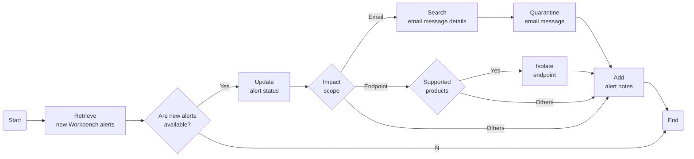

# Take a response action on the highlighted object in a Workbench alert
This task identifies the highlighted object in a Workbench alert and then takes a response action on that object.

```mermaid
graph LR;
s(Start)-->a1[Retrieve<br>new Workbench alerts];
a1-->cc1{Are new alerts<br>available?};
cc1--Yes-->a2[Update<br>alert status];
a2-->cc2{Impact<br>scope};
cc2--Email-->a3[Search<br>email message details];
a3-->a4[Quarantine<br>email message];
cc2--Endpoint-->cc3{Supported<br>products};
cc3--Yes-->a5[Isolate<br>endpoint];
a4-->a6[Add<br>alert notes];
a5-->a6;
cc2--Others-->a6;
cc3--Others-->a6;
a6-->e(End);
cc1--No-->e;
```

## Related APIs
- [Get alert history with details](https://portal.xdr.trendmicro.com/index.html#/admin/automation_center?goto=api&from=v2.0&tag=tag%2FAlerts%2Fpaths%2F~1v2.0~1xdr~1workbench~1workbenchHistories%2Fget)
- [Edit alert status](https://portal.xdr.trendmicro.com/index.html#/admin/automation_center?goto=api&from=v2.0&tag=tag%2FAlerts%2Fpaths%2F~1v2.0~1xdr~1workbench~1workbenches~1%7BworkbenchId%7D%2Fput)
- [Query information for multiple endpoints](https://portal.xdr.trendmicro.com/index.html#/admin/automation_center?goto=api&from=v2.0&tag=tag%2FSearch%2Fpaths%2F~1v2.0~1xdr~1eiqs~1query~1batch~1endpointInfo%2Fpost)
- [Isolate endpoint](https://portal.xdr.trendmicro.com/index.html#/admin/automation_center?goto=api&from=v2.0&tag=tag%2FEndpoint%2Fpaths%2F~1v2.0~1xdr~1response~1isolate%2Fpost)
- [Search for data and list all results](https://portal.xdr.trendmicro.com/index.html#/admin/automation_center?goto=api&from=v2.0&tag=tag%2FSearch%2Fpaths%2F~1v2.0~1xdr~1search~1data%2Fpost)
- [Quarantine email message](https://portal.xdr.trendmicro.com/index.html#/admin/automation_center?goto=api&from=v2.0&tag=tag%2FEmail%2Fpaths%2F~1v2.0~1xdr~1response~1quarantineMessage%2Fpost)
- [Add alert note](https://portal.xdr.trendmicro.com/index.html#/admin/automation_center?goto=api&from=v2.0&tag=tag%2FNotes%2Fpaths%2F~1v2.0~1xdr~1workbench~1workbenches~1%7BworkbenchId%7D~1notes%2Fpost)

## Required products
- At least one of the following: Deep Security, Trend Cloud One - Workload Security, Trend Micro Apex One, Trend Micro Apex One (Mac), XDR Endpoint Sensor
- Cloud App Security

## Sample code
- [Python](python/)
