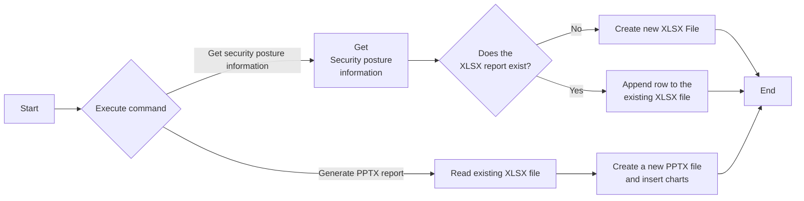

# Create custom reports in XLSX or PPTX format using data from the Security Posture API
This cookbook queries the Security Posture API once a day and creates custom reports in PPTX or XLSX format with the retrieved data. Each security metric is stored in a separate sheet inside XLSX workbooks or an individual slide in PPTX slides.

## Related APIs
- [Get security posture data](https://automation.trendmicro.com/xdr/api-beta#tag/Security-Posture/paths/~1beta~1xdr~1riskInsights~1securityPosture/get)

## Required products
- At least one Trend Micro product that connects to Trend Vision One

## Sample code
- [Python](python/)
