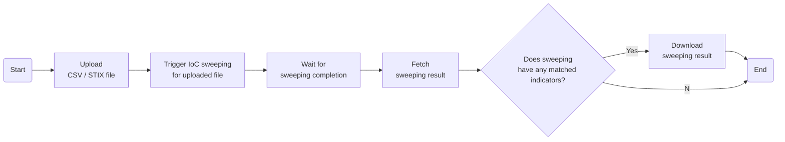

# Perform IoC Sweeping from a CSV or STIX (2.x) file
This task imports IoCs from STIX (2.x) or CSV files into a custom intelligence report, starts a sweeping task, and then checks for matched indicators.

## Related APIs
- [Import STIX and CSV files as custom intelligence reports](https://portal.xdr.trendmicro.com/index.html#/admin/automation_center?goto=api&from=v3.0&tag=tag%2FIntelligence-Reports%2Fpaths%2F~1v3.0~1threatintel~1intelligenceReports%2Fpost)
- [Trigger sweeping task](https://portal.xdr.trendmicro.com/index.html#/admin/automation_center?goto=api&from=v3.0&tag=tag%2FIntelligence-Reports%2Fpaths%2F~1v3.0~1threatintel~1intelligenceReports~1sweep%2Fpost)
- [Get task results](https://portal.xdr.trendmicro.com/index.html#/admin/automation_center?goto=api&from=v3.0&tag=tag%2FIntelligence-Reports%2Fpaths%2F~1v3.0~1threatintel~1tasks~1%7Bid%7D%2Fget)

## Required products
- At least one of the following: Deep Security, Trend Cloud One - Workload Security, Trend Micro Apex One, Trend Micro Apex One (Mac), XDR Endpoint Sensor

## Sample code
- [Python](python/)
