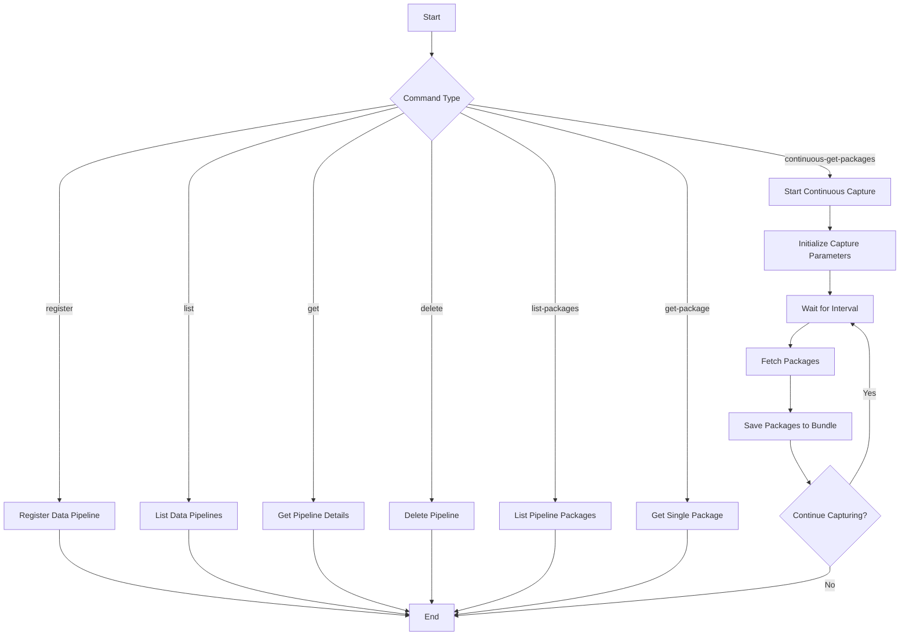

# Observed Attack Techniques Data Pipeline
This sample demonstrates how to use the Trend Vision One API to manage Observed Attack Techniques data pipelines, retrieve packages of Observed Attack Techniques data, and continuously capture Observed Attack Techniques events.

## Related APIs
- [Get Observed Attack Techniques events](https://portal.xdr.trendmicro.com/index.html#/admin/automation_center?goto=api&from=v3.0&tag=tag%2FObserved-Attack-Techniques%2Fpaths%2F~1v3.0~1oat~1detections%2Fget)

## Required products
- At least one product connected to Trend Vision One

## Sample code
- [Python](python/)
