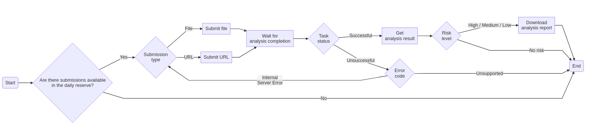

# Submit object to Sandbox Analysis
This task submits files or URLs to the sandbox and retrieves the analysis results if there are submissions available in the daily reserve. If the risk level of the submitted objects is is equal or higher to 'low', this task also downloads an analysis report.
  

## Related APIs
- [Get daily reserve](https://automation.trendmicro.com/xdr/api-v3#tag/Sandbox-Analysis/paths/~1v3.0~1sandbox~1submissionUsage/get)
- [Submit file to sandbox](https://automation.trendmicro.com/xdr/api-v3#tag/Sandbox-Analysis/paths/~1v3.0~1sandbox~1files~1analyze/post)
- [Submit URLs to sandbox](https://automation.trendmicro.com/xdr/api-v3#tag/Sandbox-Analysis/paths/~1v3.0~1sandbox~1urls~1analyze/post)
- [Get submission status](https://automation.trendmicro.com/xdr/api-v3#tag/Sandbox-Analysis/paths/~1v3.0~1sandbox~1tasks~1{id}/get)
- [Get analysis results](https://automation.trendmicro.com/xdr/api-v3#tag/Sandbox-Analysis/paths/~1v3.0~1sandbox~1analysisResults~1{id}/get)
- [Download analysis results](https://automation.trendmicro.com/xdr/api-v3#tag/Sandbox-Analysis/paths/~1v3.0~1sandbox~1analysisResults~1{id}~1report/get)
- [Download Investigation Package](https://automation.trendmicro.com/xdr/api-v3#tag/Sandbox-Analysis/paths/~1v3.0~1sandbox~1analysisResults~1{id}~1investigationPackage/get)

## Required products
- None required

## Sample code
- [Python](python/)
