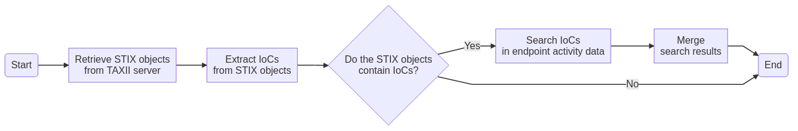

# Perform threat hunting based on IoCs from a source
This task extracts IoCs from STIX objects and then searches these IoCs in endpoint activity data for incident response.
  

## Related APIs
- [Search for data and list all results](https://automation.trendmicro.com/xdr/api-v2#tag/Search/paths/~1v2.0~1xdr~1search~1data/post)

## Required products
- At least one of the following: Deep Security, Trend Micro Cloud One - Workload Security, Trend Micro Apex One, Trend Micro Apex One (Mac), XDR Endpoint Sensor

## Sample code
- [Python](python/)
