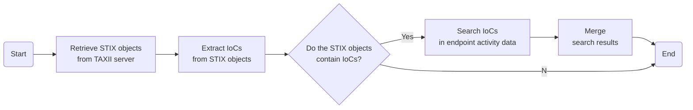

# Perform threat hunting based on IoCs from a source
This task extracts IoCs from STIX objects and then searches these IoCs in endpoint activity data for incident response.

```mermaid
graph LR;
s(Start)-->a1[Retrieve STIX objects<br>from TAXII server];
a1-->a2[Extract IoCs<br>from STIX objects];
a2-->cc1{Do the STIX objects<br>contain IoCs?};
cc1--Yes-->a3[Search IoCs<br>in endpoint activity data];
a3-->a4[Merge<br>search results];
a4-->e(End);
cc1--No-->e;
```

## Related APIs
- [Search for data and list all results](https://portal.xdr.trendmicro.com/index.html#/admin/automation_center?goto=api&from=v2.0&tag=tag%2FSearch%2Fpaths%2F~1v2.0~1xdr~1search~1data%2Fpost)

## Required products
- At least one of the following: Deep Security, Trend Cloud One - Workload Security, Trend Micro Apex One, Trend Micro Apex One (Mac), XDR Endpoint Sensor

## Sample code
- [Python](python/)
