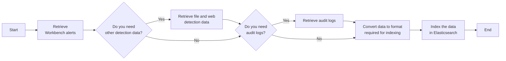

# Send Workbench alerts, audit logs, and other detection data to Elasticsearch
This task sends Workbench alerts, detections, and audit logs to Elasticsearch.

Note: You can refer to the Datalake Pipeline API Cookbook when retrieving Observed Attack Techniques events.

## Related APIs
- [Get alerts list](https://portal.xdr.trendmicro.com/index.html#/admin/automation_center?goto=api&from=v3.0&tag=tag%2FWorkbench%2Fpaths%2F~1v3.0~1workbench~1alerts%2Fget)
- [Get detection data](https://portal.xdr.trendmicro.com/index.html#/admin/automation_center?goto=api&from=v3.0&tag=tag%2FSearch%2Fpaths%2F~1v3.0~1search~1detections%2Fget)
- [Get entries from audit logs](https://portal.xdr.trendmicro.com/index.html#/admin/automation_center?goto=api&from=v3.0&tag=tag%2FAudit-Logs%2Fpaths%2F~1v3.0~1audit~1logs%2Fget)

## Required products
- At least one Trend Micro product that connects to Trend Vision One

## Sample code
- [Python](python/)
