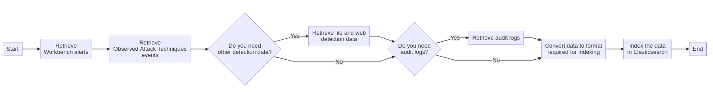

# Send Workbench alerts, audit logs, and other detection data to Elasticsearch
This task retrieves Workbench alerts, Observed Attack Technique events, detections and audit logs to Elasticsearch.
  

## Related APIs
- [Get alerts list](https://automation.trendmicro.com/xdr/api-v3#tag/Workbench/paths/~1v3.0~1workbench~1alerts/get)
- [Get Observed Attack Techniques events](https://automation.trendmicro.com/xdr/api-v3#tag/Observed-Attack-Techniques/paths/~1v3.0~1oat~1detections/get)
- [Get detection data](https://automation.trendmicro.com/xdr/api-v3#tag/Search/paths/~1v3.0~1search~1detections/get)
- [Get entries from audit logs](https://automation.trendmicro.com/xdr/api-v3#tag/Audit-Logs/paths/~1v3.0~1audit~1logs/get)

## Required products
- At least one Trend Micro product that connects to Trend Micro Vision One

## Sample code
- [Python](python/)
