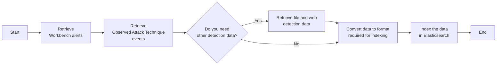

# Send Workbench alerts and other detection data to Elasticsearch
This task sends data about Workbench alerts, events that may trigger alerts (Observed Attack Technique events), and other detections to Elasticsearch.

## Related APIs
- [Get alert history with details](https://automation.trendmicro.com/xdr/api-v2#tag/Alerts/paths/~1v2.0~1xdr~1workbench~1workbenchHistories/get)
- [Search Observed Attack Techniques event list](https://automation.trendmicro.com/xdr/api-v2#tag/Observed-Attack-Techniques/paths/~1v2.0~1xdr~1oat~1detections/get)
- [Search for data and list all results](https://automation.trendmicro.com/xdr/api-v2#tag/Search/paths/~1v2.0~1xdr~1search~1data/post)

## Required products
- At least one Trend Micro product that connects to Trend Vision One

## Sample code
- [Python](python/)
