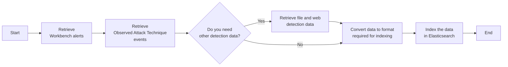

# Send Workbench alerts and other detection data to Elasticsearch
This task sends data about Workbench alerts, events that may trigger alerts (Observed Attack Technique events), and other detections to Elasticsearch.

```mermaid
graph LR;
s[Start] --> wb[Retrieve<br>Workbench alerts];
wb --> oat[Retrieve<br>Observed Attack Technique<br>events];
oat --> opt{Do you need<br>other detection data?};
opt -- Yes --> d[Retrieve file and web<br>detection data];
d --> cd[Convert data to format<br>required for indexing];
opt -- No --> cd;
cd --> ie[Index the data<br>in Elasticsearch];
ie --> e[End];
```

## Related APIs
- [Get alert history with details](https://portal.xdr.trendmicro.com/index.html#/admin/automation_center?goto=api&from=v2.0&tag=tag%2FAlerts%2Fpaths%2F~1v2.0~1xdr~1workbench~1workbenchHistories%2Fget)
- [Search Observed Attack Techniques event list](https://portal.xdr.trendmicro.com/index.html#/admin/automation_center?goto=api&from=v2.0&tag=tag%2FObserved-Attack-Techniques%2Fpaths%2F~1v2.0~1xdr~1oat~1detections%2Fget)
- [Search for data and list all results](https://portal.xdr.trendmicro.com/index.html#/admin/automation_center?goto=api&from=v2.0&tag=tag%2FSearch%2Fpaths%2F~1v2.0~1xdr~1search~1data%2Fpost)

## Required products
- At least one TrendAI™ product that connects to TrendAI Vision One™

## Sample code
- [Python](python/)
